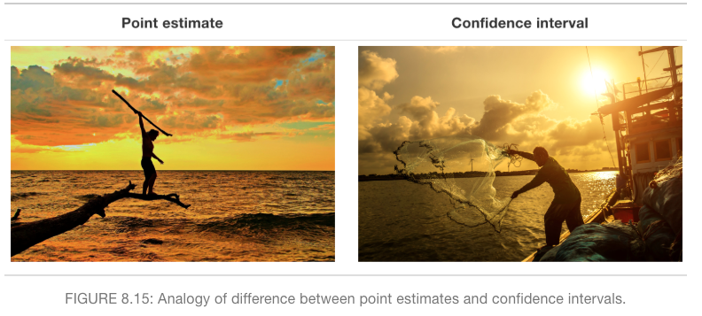

---
output:
  xaringan::moon_reader:
    lib_dir: libs
    css: [default, hygge, xaringan-themer.css]
    seal: false
    nature:
      beforeInit: "https://platform.twitter.com/widgets.js"
      highlightStyle: github
      highlightLines: true
      countIncrementalSlides: false
---

class: inverse, left, bottom
background-image: url(https://images.unsplash.com/photo-1509817177816-ca503fa03f60?ixid=MXwxMjA3fDB8MHxwaG90by1wYWdlfHx8fGVufDB8fHw%3D&ixlib=rb-1.2.1&auto=format&fit=crop&w=1350&q=80)
background-size: cover

# .Large[association and causation]

## .small[MA206]
#### .tiny[Dr. Evangeline Reynolds | Meeting 12 | 2021-03-01 | Image credit: Sam Goodgame, Upsplash]


???

Title slide


```{r, echo = F}
doc_type <- "pres"
library(flipbookr)
library(tidyverse)
library(madlibs)
```

```{r xaringan-themer, include = FALSE}
library(xaringanthemer)

xaringanthemer::mono_light(
  base_color = "#4c5253",
  header_font_google = google_font("Josefin Sans"),
  text_font_google   = google_font("Josefin Sans", "200", "200i"),
  code_font_google   = google_font("Droid Mono"),
  text_font_size = "1.2cm",
  code_font_size = ".45cm")
  
```

```{r, echo = F}
knitr::opts_chunk$set(message = F, warning = F, comment = "", fig.height = 6, echo = F)
```


<!--  -->


```{r}

```


---

# Agenda

  - housekeeping
  - confidence interval review
  - association
  - causation
  - loading data practice w/ lung capacity example (spuriousness/confounding)

---

# Housekeeping

  - Exploration Exercise #2
  - SIL
  - Video
  - Attendance
  - Midterm
  
---

Note on Exploration Exercise 2:


```{r, echo = T}
prop.test(x = 99, # observed successes
          n = 100, # num observations
          p = .5, # parameter, pi for null
          correct = F
          )
```

---

```{r, echo = F}

```


---

# Confidence interval formal definition

--

The 95% confidence interval is the interval that will encompass the population parameter, 95 in 100 times when calculated for repeated samples.

---

Usually we just have one sample.  

--

If I calculate the 95% confidence interval for my single sample, the true mean probably lies in that interval, but I must acknowledge I might have, by chance, on of the "bad samples" -- the 5 in 100 times when my interval doesn't encompass the true population mean.


---

`r chunk_reveal("multittest", break_type = 20, widths = c(1,1))`


```{r multittest, include=F}
ggplot(tibble(height = runif(20))) +
  aes(x = height) +
  geom_rug() +
  ggxmean:::geom_ttestconf(
    size = 2, 
    color = "mediumvioletred", 
    alpha = .75, 
    y = -.01, 
    conf.level = .90) +
  ggxmean::geom_xmean(
    linetype = "dashed",
    color = "mediumvioletred",
    size = 1.5
    ) +
  ggxmean:::geom_tdist(
    height = 1, 
    alpha = .5, 
    fill = "mediumvioletred"
    ) +
  geom_vline(
    xintercept = .5,
    linetype = "dotted", 
    size = 1.5
    ) +
  scale_x_continuous(limits = c(0, 1))
```

---
class: inverse, center, middle

# Laymans definition:  I'm 95% confident that the true value is in this interval


---
class: inverse, middle, center

  
# Association between variables

---
class: inverse, middle, center


# Is there a statistically significant relationship between my variables?

---
class: inverse, middle, center


# Two continuous variables...

---


```{r}
library(tidyverse)
library(gapminder)

gm_2007 <- gapminder %>% 
  filter(year == 2007)
```


---

`r chunk_reveal("scatter1",widths = c(1,1))`

```{r scatter1, include = F}
ggplot(data = gm_2007) +
  aes(x = gdpPercap) +
  aes(y = lifeExp) +
  geom_point() +
  labs(x = "GDP per capita (US$ constant)", y = "Life Expectency (years)") +
  geom_text(aes(label = country), 
            check_overlap = T) + # 
  labs(title = "Life Expectancy v. Wealth, 2007")
```
---


---
class: inverse, middle, center


# Two categorical, binary variables...

---

`r chunk_reveal("twoway",widths = c(1,1))`


```{r twoway, include = F}
tibble(signal = c("right", "left", "left", "right", "left", "right", "left", "left", "right", "right", "right","right", "left", "left", "right", "left"),
       buzz_lever = c("right", "left", "right", "right", "left", "right", "left", "left", "right", "right", "right","right", "left", "left", "right", "left")) %>% 
  mutate(success = signal == buzz_lever) ->
dolphin_experiment

# jitter plot
ggplot(data = dolphin_experiment) +
  theme_minimal(base_size = 30) +
  aes(x = signal) +
  aes(y = buzz_lever) +
  geom_jitter(width = .2, 
              height = .2) +
  geom_count(color = "blue", 
             alpha = .5) ->
buzz_plot

# contingency table
dolphin_experiment %>% 
  # select to only the vars of interest
  select(signal, buzz_lever) %>% 
  table() %>% 
  plot()
```


---

`r chunk_reveal("survive", widths = c(1,1))`

```{r survive, include=F}
Titanic %>%
  as.data.frame() %>%
  uncount(weights = Freq) ->
titanic_raw_data

ggplot(data = titanic_raw_data) +
  theme_minimal(base_size = 30) +
  aes(x = Sex) +
  aes(y = Survived) +
  geom_jitter(width = .2, 
              height = .2) +
  geom_count(color = "blue",
             alpha = .5) ->
titanic_plot

titanic_raw_data %>% 
  select(Sex, Survived) %>% 
  table() %>% 
  plot()
```

---


`r chunk_reveal("survive2",widths = c(1,1))`

```{r survive2, include=F}
Titanic %>%
  as.data.frame() %>%
  uncount(weights = Freq) ->
titanic_raw_data

ggplot(data = 
         titanic_raw_data) +
  theme_minimal(base_size = 30) +
  aes(x = Sex) +
  aes(fill = Survived) +
  geom_bar() ->
simple_bar

ggplot(data = titanic_raw_data) +
  theme_minimal(base_size = 30) +
  aes(x = Sex) +
  aes(fill = Survived) +
  geom_bar(position = "fill") ->
proportion_bar
```

---


---
class: middle, center, inverse

# continuous and categorical binary variable

---

`r chunk_reveal("boxplot",widths = c(1,1))`

```{r boxplot, include = F}
faithful %>% 
  mutate(duration_type = 
           case_when(eruptions > 3 ~ "long",
                    eruptions <= 3 ~ "short")) ->
faithful_prep

ggplot(faithful_prep) +
  theme_minimal(base_size = 25) +
  aes(x = duration_type) +
  aes(y = waiting) +
  geom_jitter(width = .2,
              alpha = .4) +
  geom_boxplot(alpha = 0)
```


---
class: inverse, middle, center

Causal relationships?
--
Does movement in one variable *cause* movement in another?
--
When we visualize what does X usually imply, what does y position imply? 


---
# Two paths:  Asserting causal effect

https://www.theatlantic.com/video/index/555959/robert-frost-road-not-taken/


---

# Frost Poem

---

.pull-left[Two roads diverged in a yellow wood,
And sorry I could not travel both
And be one traveler, long I stood
And looked down one as far as I could
To where it bent in the undergrowth;]

.pull-right[Then took the other, as **just as fair,**
And having perhaps the better claim,
Because it was grassy and wanted wear;
**Though as for that the passing there**
**Had worn them really about the same,**]

---

.pull-left[And both that morning equally lay
In leaves no step had trodden black.
Oh, I kept the first for another day!
Yet knowing how way leads on to way,
I doubted if I should ever come back.]

.pull-right[**I shall be telling this with a sigh**
Somewhere ages and ages hence:
Two roads diverged in a wood, and I—
I took the one less traveled by,
And that has made all the difference.]

---
class: inverse, center, middle

*The two paths might not be that different - have given the same result.*


--

*Nagging question: I know what I'll probably be saying in the future, but will it really be true?  Has taking that particular road it really made a difference?*


---

- Poem's final lines are often interpreted as triumphant:  the decision was a very consequential one."

--

but 

- "Frost liked to warn listeners (and readers) that 'you have to be careful of that one; it’s a tricky poem—very tricky.'" https://www.poetryfoundation.org/articles/89511/robert-frost-the-road-not-taken

---

# Fundamental problem of causal inference

We can't observe O|T and O|C

Gold standard for causal inference: 
 - Randomized Control Trials


---

# What comparisons do I *want* to make?

*Shall I compare thee to a summer's day?* (Shakespeare Sonnet 18)


---

Same unit to itself - treated and control (untreated)

$BloodPressure_(Joe) | drug$ and $BloodPressure_(Joe) | placebo$

What is the treatment effect:

--
$$(BloodPressure_(Joe) | drug) -$$

$$(BloodPressure_(Joe) | placebo)$$


---
# Fundamental problem of causal inference

"It is impossible to observe the effect of more than one treatment on a subject at one time. Joe cannot both take the pill and not take the pill at the same time."


--

(Just as the traveler in the poem cannot take both paths!)


---


|                | Treatment | Control       | Causal Effect  (T-C)        |
| ----------- | ----------- | ----------- | ----------- |
| Joe            |        3              | ?                    | 3-?         |
| Amy            | ?                    |       9               | ?-9       |
| Fred           | ?                    |       12               | ?-12                    |
| Angela         |         4             | ?                    | 4-?          |
| Chris          | ?                    |        9      | ?-9                        |
| Tim            |        7              | ?                    | 7-?                        |
| Roger          |         6             | ?                    | 6-?                        |
| **Average**        | **5**    | **10** | **5 - 10** |


---
class: inverse


# "Random assignment helps balance out potential confounding variables among the explanatory variable groups, giving us cause-and-effect conclusions" 


---

## Do you think this study is "underpowered"? 

--

Remember statistical power speaks to whether a study is able to uncover a statistically significant result.  Small numbers of observations in studies often lead them to be "underpowered".


---


Some paths to correlation: 

- causation

--

- spuriousness (confounding)

--

- reverse causation

--

- chance

---
# Beyond correlation:  randomized control trials and causal inference

RCT - Randomized control trial. 
--
The **gold standard** for causal inference

--
Let's us compare averages of groups of people (observational units) -- each of which has opportunity to be in the control or treatment group; random assignment determines which group they are in. 


---

# Which problematic causal pathways are eliminated using RCT?

---
class: inverse, center, middle

# Hey, we talked about random sampling before?  
--
Is that the same thing as random assignment (in a randomized control trial experiment)?
--

No.

---
class: center, middle

# Random Sampling 
--
let's me generalize to a larger population
--
to estimate a population parameter(s)

---
class: center, middle


## Random Assignment 
--
helps me establish causality 
--
by giving me exogenous variation 
--
i.e. eliminating other problematic pathways (confounding)

---
class: center, middle

### Which is an *observational study* and with is *a Randomized control trial*?

--

### I take a simple randomly sample 150 students from NY private high schools and 200 from a public school and look at the difference in those groups ACT scores.  Do the groups, on average, score differently?

--

### I have a large grant to study the effect of private schooling.  From a set of students, I'm able to randomly select some send those to private school for a year.  I compare how the two groups do on ACT after that period. 


---

# Data download for exploring confounding. Blackboard -> datasets.
