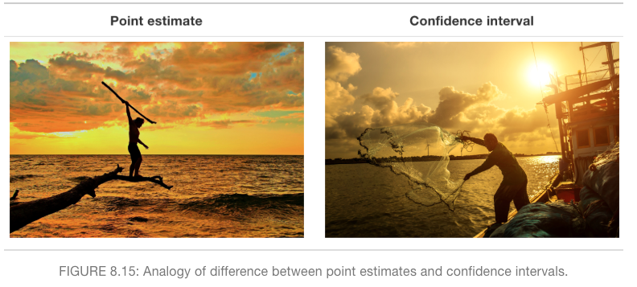

---
output:
  xaringan::moon_reader:
    lib_dir: libs
    css: [default, hygge, xaringan-themer.css]
    seal: false
    nature:
      beforeInit: "https://platform.twitter.com/widgets.js"
      highlightStyle: github
      highlightLines: true
      countIncrementalSlides: false
---

class: inverse, left, bottom
background-image: url(https://images.unsplash.com/photo-1509817177816-ca503fa03f60?ixid=MXwxMjA3fDB8MHxwaG90by1wYWdlfHx8fGVufDB8fHw%3D&ixlib=rb-1.2.1&auto=format&fit=crop&w=1350&q=80)
background-size: cover

# .Large[association and causation]

## .small[MA206]
#### .tiny[Dr. Evangeline Reynolds | Meeting 12 | 2021-03-01 | Image credit: Sam Goodgame, Upsplash]


???

Title slide


```{r, echo = F}
doc_type <- "pres"
library(flipbookr)
library(tidyverse)
library(madlibs)
```

```{r xaringan-themer, include = FALSE}
library(xaringanthemer)

xaringanthemer::mono_light(
  base_color = "#4c5253",
  header_font_google = google_font("Josefin Sans"),
  text_font_google   = google_font("Josefin Sans", "200", "200i"),
  code_font_google   = google_font("Droid Mono"),
  text_font_size = "1.2cm",
  code_font_size = ".45cm")
  
```

```{r, echo = F}
knitr::opts_chunk$set(message = F, warning = F, comment = "", fig.height = 6, echo = F)
```


<!--  -->


```{r}

```


---

# Agenda

  - housekeeping
  - confidence interval review
  - association
  - causation
  - loading data practice w/ lung capacity example (spuriousness/confounding)

---

# Housekeeping

  - Exploration Exercise #2
  - SIL
  - Video
  - Attendance
  - Midterm
  
---


---
class: inverse, middle, center

  
# Association between variables

---
class: inverse, middle, center


---
class: inverse, middle, center


# Two categorical, binary variables...

---

`r chunk_reveal("twoway")`


```{r twoway, include = F}
tibble(signal = c("right", "left", "left", "right", "left", "right", "left", "left", "right", "right", "right","right", "left", "left", "right", "left"),
       buzz_lever = c("right", "left", "right", "right", "left", "right", "left", "left", "right", "right", "right","right", "left", "left", "right", "left")) %>% 
  mutate(success = signal == buzz_lever) ->
dolphin_experiment

# jitter plot
ggplot(data = dolphin_experiment) +
  theme_minimal(base_size = 30) +
  aes(x = signal) +
  aes(y = buzz_lever) +
  geom_jitter(width = .2, 
              height = .2) +
  geom_count(color = "blue", 
             alpha = .5) ->
buzz_plot

# contingency table
dolphin_experiment %>% 
  # select to only the vars of interest
  select(signal, buzz_lever) %>% 
  table() %>% 
  plot()
```

---


`r chunk_reveal("survive")`

```{r survive, include=F}
Titanic %>%
  as.data.frame() %>%
  uncount(weights = Freq) ->
titanic_raw_data

ggplot(data = titanic_raw_data) +
  theme_minimal(base_size = 30) +
  aes(x = Sex) +
  aes(y = Survived) +
  geom_jitter(width = .2, 
              height = .2) +
  geom_count(color = "blue",
             alpha = .5) ->
titanic_plot

titanic_raw_data %>% 
  select(Sex, Survived) %>% 
  table() %>% 
  plot()
```


---


---

```{r}
ggplot(data = titanic_raw_data %>% sample_n(30, replace = F)) +
  theme_minimal(base_size = 30) +
  aes(x = Sex) +
  aes(fill = Survived) +
  ggxmean:::geom_barbrick()
```


